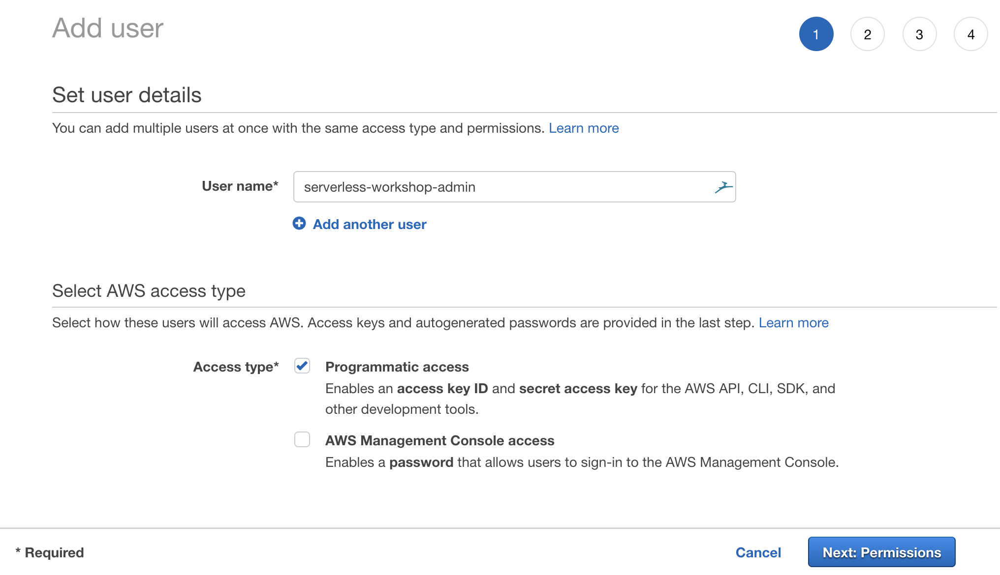
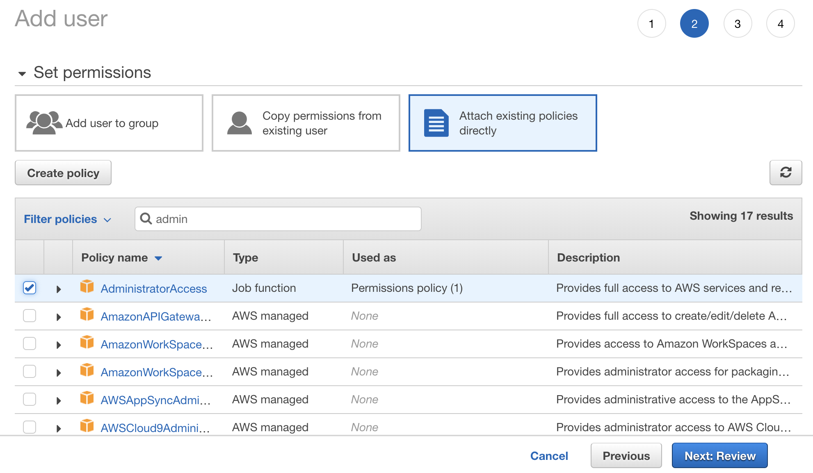
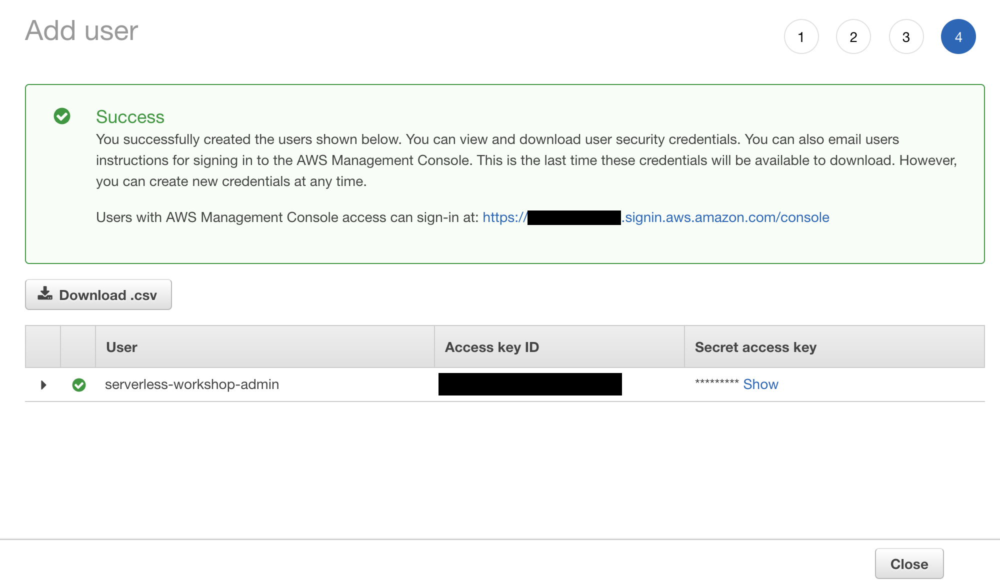

**[Setup Mac](#mac)** | **[Setup Windows](#windows)** | **[Setup AWS](#setup-aws-credentials)**

# Setup

We will be leveraging Python and the Serverless framework for this workshop. 

## Mac


### Package Manager


We will be using [Homebrew](https://brew.sh/) to manage our software installs. To install Homebrew run the following command in Terminal 

```bash
/usr/bin/ruby -e "$(curl -fsSL https://raw.githubusercontent.com/Homebrew/install/master/install)"
```

### Installing Python + Pip

**Python** should already be installed on your machine, however if it is not you should run the following

```bash
brew install python
```

We will also need **pip** for this workshop. You can install pip by running the following command.

```bash
sudo easy_install pip
```

Lastly, let's install **pipenv**. It automatically creates and manages a virtualenv for your projects to keep your python dependencies easy to manage

```bash
brew install pipenv 
```

### Installing Node + Serverless Framework

```bash
brew install node
```

Now that we have Node installed we want to install the [Serverless Framework](https://serverless.com/). This framework comes as a npm package that we will want to install globally on our machine.

```bash
npm install -g serverless
```

### Installing AWS CLI

Lastly, we need to install the AWS CLI

``` bash
brew install awscli
```

## Windows

### Full and updated instructions: 
https://docs.aws.amazon.com/cli/latest/userguide/awscli-install-windows.html

### Installing Node + Serverless Framework

- [NodeJS download page](https://nodejs.org/en/download)
- [NodeJS 64-bit installer](https://nodejs.org/dist/v8.12.0/node-v8.12.0-x64.msi)
- [NodeJS 32-bit installer](https://nodejs.org/dist/v8.12.0/node-v8.12.0-x86.msi)


Now that we have Node installed we want to install the [Serverless Framework](https://serverless.com/). This framework comes as a npm package that we will want to install globally on our machine.

```bash
npm install -g serverless
```

### Installing Python + Pip

- [Python download page](https://www.python.org/downloads/release/python-367)
- [Python 64-bit installer](https://www.python.org/ftp/python/3.6.7/python-3.6.7-amd64.exe)
- [Python 32-bit installer](https://www.python.org/ftp/python/3.6.7/python-3.6.7.exe)


Once you have **Python** and **pip** installed, let's install **pipenv**. It automatically creates and manages a virtualenv for your projects to keep your python dependencies easy to manage. In a command prompt window, run the following:

```
pip install --user pipenv
```

### Installing AWS CLI
The easiest way to install the AWS CLI is to download and run the MSI
- [AWS CLI 64-bit installer](https://s3.amazonaws.com/aws-cli/AWSCLI64PY3.msi)
- [AWS CLI 32-bit installer](https://s3.amazonaws.com/aws-cli/AWSCLI32PY3.msi)

## Setup AWS Credentials

Now that we have installed Python, Pip, Node and the Serverless Framework. We need to setup our AWS Access and Secret keys to be used by the Serverless Framework.

### Creating AWS Credentials

For the purposes of this workshop we will be creating a programmatic access user with Admin access. 

_*NOTE*: You should not share the keys you are creating with anyone. Furthermore, once this workshop concludes you should consider disabling your admin access user._

To create a programmatic user we will need to navigate to the [IAM Management Console](https://console.aws.amazon.com/iam/home?#/users$new?step=details).


Create a user, making sure to grant programmatic access. This will generate an access and secret key that the Serverless Framework will need to create resources for us



Next we will want to give our new user Admin rights. In production we would only grant the rights we need for an application but since this is a quick demo application lets select `AdministratorAccess`.


After creating the user make sure to download the user credentials as a csv. 


_*NOTE*: This is the only time you will be able to download the credentials. If you do not do this now you will need to create a completely new user._



Our last step is to add our new Access and Secret key to our list of AWS Credentials. To check our current credentials, run the following command.

```bash
cat ~/.aws/credentials
```

We will want to update the default profile in our credentials file with our new access and secret keys

```
[default]
aws_access_key_id = your_access_key_here
aws_secret_access_key = your_secret_key_here
```
